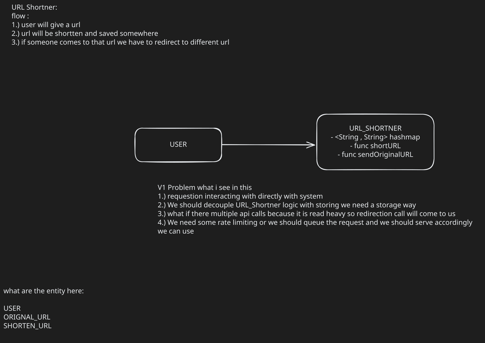

# URL Shortener — Design Notes

This document captures my current thinking on the URL Shortener design. It's a
working draft — the low-level design (LLD) diagram below is generated
automatically from the `.excalidraw` source via the GitHub Actions workflow in
this repo, so it always reflects the latest version of the diagram.

## LLD



## Flow

1. User gives a URL.
2. The URL is shortened and saved somewhere.
3. When someone visits the shortened URL, we redirect them to the original URL.

## Entities

- **USER**
- **ORIGINAL_URL**
- **SHORTEN_URL**

## URL_SHORTENER (current shape)

- `<String, String>` hashmap — maps shortened URL → original URL
- `func shortURL(originalURL) -> shortURL`
- `func sendOriginalURL(shortURL) -> originalURL`

## V1 — problems I see with this

1. The request interacts directly with the system — no separation between the
   API layer and the core shortening logic.
2. We should decouple the URL-shortening logic from storage. We need an actual
   storage layer instead of an in-memory hashmap.
3. Redirection is read-heavy — there will be many more reads (redirects) than
   writes (new short URLs), so we need to think about how we handle a high
   volume of concurrent redirect calls.
4. We need rate limiting, or we should queue incoming requests and serve them
   accordingly, instead of handling everything synchronously and directly.

## Open questions / next steps

- Decide on the storage layer (in-memory cache + persistent DB? which DB?).
- Design the short-code generation strategy (hash-based, counter-based,
  base62 encoding, collision handling).
- Figure out the caching strategy for read-heavy redirect traffic.
- Decide on rate limiting approach (per-user, per-IP, token bucket, queue-based).

## Run tests 
```
javac -d out Controller/*.java Repository/*.java Strategy/*.java service/*.java LoadTest.java ConcurrencyTest.java
java -cp out LoadTest 50000
java -cp out ConcurrencyTest 50 500
```

# Result
## Till now  
```
javac -d out Controller/*.java Repository/*.java Strategy/*.java service/*.java LoadTest.java ConcurrencyTest.java
java -cp out LoadTest 50000
java -cp out ConcurrencyTest 50 500
```

```
================ LOAD TEST ================
Requests to run  : 50000
Mode             : single-threaded, sequential
=============================================

---------------- CREATE phase ----------------
Total time         : 0.165 s
Throughput         : 302467.9 creates/sec
Avg latency        : 0.00331 ms/op
Create failures    : 0
Duplicate shortURLs: 0

----------------- READ phase ------------------
Total time         : 0.013 s
Throughput         : 3777091.2 reads/sec
Avg latency        : 0.00026 ms/op
Read failures      : 0
Read mismatches    : 0

---------------- TEST CASES ----------------
  [PASS] TC1: all creates succeeded (no exceptions)
  [PASS] TC2: every short URL generated is unique
  [PASS] TC3: every created URL is readable immediately after
  [PASS] TC4: every read resolves to the correct original URL
  [PASS] TC5: create throughput is at least 500 ops/sec

=============== TEST SUMMARY ===============
Passed : 5 / 5
Failed : 0 / 5
==============================================
VERDICT: PASS - system stayed correct under sequential load
==============================================
============= CONCURRENCY TEST =============
Threads          : 50
Ops per thread   : 500
Total create ops : 25000
==============================================

------------------ Results ------------------
Wall time                 : 0.196 s
Throughput                : 127551.2 creates/sec (across 50 threads)
Total create attempts     : 25000
Create exceptions         : 0
Unique short URLs produced: 21592
Short-code collisions     : 3408
Immediate read failures   : 24871
Immediate read mismatches : 16

Sample collisions (first 5):
  COLLISION on https://ourwebsite/1048 while creating https://example.com/thread41/item1
  COLLISION on https://ourwebsite/1202 while creating https://example.com/thread43/item56
  COLLISION on https://ourwebsite/1228 while creating https://example.com/thread3/item3
  COLLISION on https://ourwebsite/1229 while creating https://example.com/thread43/item63
  COLLISION on https://ourwebsite/1253 while creating https://example.com/thread10/item7

---------------- TEST CASES ----------------
  [PASS] TC1: no exceptions thrown while creating under concurrency
  [FAIL] TC2: no two threads generated the same short code (counter is thread-safe)  (3408 collision(s) - static counter increment is racy)
  [FAIL] TC3: unique short URLs produced == total successful creates  (21592 unique vs 25000 expected)
  [FAIL] TC4: a URL is immediately readable right after its own thread created it  (24871 / 25000 read-your-write checks failed - master/slave replication race)
  [FAIL] TC5: reads that succeed return the correct original URL  (16 reads returned the WRONG original URL)

=============== TEST SUMMARY ===============
Passed : 1 / 5
Failed : 4 / 5

Failed test cases:
  - TC2: no two threads generated the same short code (counter is thread-safe) -> 3408 collision(s) - static counter increment is racy
  - TC3: unique short URLs produced == total successful creates -> 21592 unique vs 25000 expected
  - TC4: a URL is immediately readable right after its own thread created it -> 24871 / 25000 read-your-write checks failed - master/slave replication race
  - TC5: reads that succeed return the correct original URL -> 16 reads returned the WRONG original URL
==============================================
VERDICT: FAIL - 4 test case(s) failed - service is NOT thread-safe
==============================================

```
## Debugged
Understanding is I have to make it thread safe 
<br>Accourding my understanding I should use atomic increament instead of ++

## New Results
there is only one problem i see that it creating n number of threads which is not good i need a thread pool 

```
$ javac -d out Controller/*.java Repository/*.java Strategy/*.java service/*.java LoadTest.java ConcurrencyTest.java
java -cp out LoadTest 500000
java -cp out ConcurrencyTest 500 5000
================ LOAD TEST ================
Requests to run  : 500000
Mode             : single-threaded, sequential
=============================================

---------------- CREATE phase ----------------
Total time         : 0.651 s
Throughput         : 768556.1 creates/sec
Avg latency        : 0.00130 ms/op
Create failures    : 0
Duplicate shortURLs: 0

----------------- READ phase ------------------
Total time         : 0.046 s
Throughput         : 10906505.1 reads/sec
Avg latency        : 0.00009 ms/op
Read failures      : 0
Read mismatches    : 0

---------------- TEST CASES ----------------
  [PASS] TC1: all creates succeeded (no exceptions)
  [PASS] TC2: every short URL generated is unique
  [PASS] TC3: every created URL is readable immediately after
  [PASS] TC4: every read resolves to the correct original URL
  [PASS] TC5: create throughput is at least 500 ops/sec

=============== TEST SUMMARY ===============
Passed : 5 / 5
Failed : 0 / 5
==============================================
VERDICT: PASS - system stayed correct under sequential load
==============================================
============= CONCURRENCY TEST =============
Threads          : 500
Ops per thread   : 5000
Total create ops : 2500000
==============================================

------------------ Results ------------------
Wall time                 : 3.575 s
Throughput                : 699345.9 creates/sec (across 500 threads)
Total create attempts     : 2500000
Create exceptions         : 0
Unique short URLs produced: 2500000
Short-code collisions     : 0
Immediate read failures   : 0
Immediate read mismatches : 0

---------------- TEST CASES ----------------
  [PASS] TC1: no exceptions thrown while creating under concurrency
  [PASS] TC2: no two threads generated the same short code (counter is thread-safe)
  [PASS] TC3: unique short URLs produced == total successful creates
  [PASS] TC4: a URL is immediately readable right after its own thread created it
  [PASS] TC5: reads that succeed return the correct original URL

=============== TEST SUMMARY ===============
Passed : 5 / 5
Failed : 0 / 5
==============================================
VERDICT: PASS - service is thread-safe under concurrent load
==============================================


```

# URL Shortener — Design Notes

This document captures my current thinking on the URL Shortener design. It's a
working draft — the low-level design (LLD) diagram below is generated
automatically from the `.excalidraw` source via the GitHub Actions workflow in
this repo, so it always reflects the latest version of the diagram.

## LLD

## Flow

1. User gives a URL.
2. The URL is shortened and saved somewhere.
3. When someone visits the shortened URL, we redirect them to the original URL.

## Entities

* **USER**
* **ORIGINAL_URL**
* **SHORTEN_URL**

## URL_SHORTENER (current shape)

* `<String, String>` hashmap — maps shortened URL → original URL
* `func shortURL(originalURL) -> shortURL`
* `func sendOriginalURL(shortURL) -> originalURL`

## V1 — problems I see with this

1. The request interacts directly with the system — no separation between the
   API layer and the core shortening logic.
2. We should decouple the URL-shortening logic from storage. We need an actual
   storage layer instead of an in-memory hashmap.
3. Redirection is read-heavy — there will be many more reads (redirects) than
   writes (new short URLs), so we need to think about how we handle a high
   volume of concurrent redirect calls.
4. We need rate limiting, or we should queue incoming requests and serve them
   accordingly, instead of handling everything synchronously and directly.

## Open questions / next steps

* Decide on the storage layer (in-memory cache + persistent DB? which DB?).
* Design the short-code generation strategy (hash-based, counter-based,
  base62 encoding, collision handling).
* Figure out the caching strategy for read-heavy redirect traffic.
* Decide on rate limiting approach (per-user, per-IP, token bucket, queue-based).

## Run tests

```
javac -d out Controller/*.java Repository/*.java Strategy/*.java service/*.java LoadTest.java ConcurrencyTest.java
java -cp out LoadTest 50000
java -cp out ConcurrencyTest 50 500

```

# Result

## Till now

```
javac -d out Controller/*.java Repository/*.java Strategy/*.java service/*.java LoadTest.java ConcurrencyTest.java
java -cp out LoadTest 50000
java -cp out ConcurrencyTest 50 500

```

```
================ LOAD TEST ================
Requests to run  : 50000
Mode             : single-threaded, sequential
=============================================

---------------- CREATE phase ----------------
Total time         : 0.165 s
Throughput         : 302467.9 creates/sec
Avg latency        : 0.00331 ms/op
Create failures    : 0
Duplicate shortURLs: 0

----------------- READ phase ------------------
Total time         : 0.013 s
Throughput         : 3777091.2 reads/sec
Avg latency        : 0.00026 ms/op
Read failures      : 0
Read mismatches    : 0

---------------- TEST CASES ----------------
  [PASS] TC1: all creates succeeded (no exceptions)
  [PASS] TC2: every short URL generated is unique
  [PASS] TC3: every created URL is readable immediately after
  [PASS] TC4: every read resolves to the correct original URL
  [PASS] TC5: create throughput is at least 500 ops/sec

=============== TEST SUMMARY ===============
Passed : 5 / 5
Failed : 0 / 5
==============================================
VERDICT: PASS - system stayed correct under sequential load
==============================================
============= CONCURRENCY TEST =============
Threads          : 50
Ops per thread   : 500
Total create ops : 25000
==============================================

------------------ Results ------------------
Wall time                 : 0.196 s
Throughput                : 127551.2 creates/sec (across 50 threads)
Total create attempts     : 25000
Create exceptions         : 0
Unique short URLs produced: 21592
Short-code collisions     : 3408
Immediate read failures   : 24871
Immediate read mismatches : 16

Sample collisions (first 5):
  COLLISION on https://ourwebsite/1048 while creating https://example.com/thread41/item1
  COLLISION on https://ourwebsite/1202 while creating https://example.com/thread43/item56
  COLLISION on https://ourwebsite/1228 while creating https://example.com/thread3/item3
  COLLISION on https://ourwebsite/1229 while creating https://example.com/thread43/item63
  COLLISION on https://ourwebsite/1253 while creating https://example.com/thread10/item7

---------------- TEST CASES ----------------
  [PASS] TC1: no exceptions thrown while creating under concurrency
  [FAIL] TC2: no two threads generated the same short code (counter is thread-safe)  (3408 collision(s) - static counter increment is racy)
  [FAIL] TC3: unique short URLs produced == total successful creates  (21592 unique vs 25000 expected)
  [FAIL] TC4: a URL is immediately readable right after its own thread created it  (24871 / 25000 read-your-write checks failed - master/slave replication race)
  [FAIL] TC5: reads that succeed return the correct original URL  (16 reads returned the WRONG original URL)

=============== TEST SUMMARY ===============
Passed : 1 / 5
Failed : 4 / 5

Failed test cases:
  - TC2: no two threads generated the same short code (counter is thread-safe) -> 3408 collision(s) - static counter increment is racy
  - TC3: unique short URLs produced == total successful creates -> 21592 unique vs 25000 expected
  - TC4: a URL is immediately readable right after its own thread created it -> 24871 / 25000 read-your-write checks failed - master/slave replication race
  - TC5: reads that succeed return the correct original URL -> 16 reads returned the WRONG original URL
==============================================
VERDICT: FAIL - 4 test case(s) failed - service is NOT thread-safe
==============================================


```

## Debugged

Understanding is I have to make it thread safe


Accourding my understanding I should use atomic increament instead of ++

## New Results

there is only one problem i see that it creating n number of threads which is not good i need a thread pool

```
$ javac -d out Controller/*.java Repository/*.java Strategy/*.java service/*.java LoadTest.java ConcurrencyTest.java
java -cp out LoadTest 500000
java -cp out ConcurrencyTest 500 5000
================ LOAD TEST ================
Requests to run  : 500000
Mode             : single-threaded, sequential
=============================================

---------------- CREATE phase ----------------
Total time         : 0.651 s
Throughput         : 768556.1 creates/sec
Avg latency        : 0.00130 ms/op
Create failures    : 0
Duplicate shortURLs: 0

----------------- READ phase ------------------
Total time         : 0.046 s
Throughput         : 10906505.1 reads/sec
Avg latency        : 0.00009 ms/op
Read failures      : 0
Read mismatches    : 0

---------------- TEST CASES ----------------
  [PASS] TC1: all creates succeeded (no exceptions)
  [PASS] TC2: every short URL generated is unique
  [PASS] TC3: every created URL is readable immediately after
  [PASS] TC4: every read resolves to the correct original URL
  [PASS] TC5: create throughput is at least 500 ops/sec

=============== TEST SUMMARY ===============
Passed : 5 / 5
Failed : 0 / 5
==============================================
VERDICT: PASS - system stayed correct under sequential load
==============================================
============= CONCURRENCY TEST =============
Threads          : 500
Ops per thread   : 5000
Total create ops : 2500000
==============================================

------------------ Results ------------------
Wall time                 : 3.575 s
Throughput                : 699345.9 creates/sec (across 500 threads)
Total create attempts     : 2500000
Create exceptions         : 0
Unique short URLs produced: 2500000
Short-code collisions     : 0
Immediate read failures   : 0
Immediate read mismatches : 0

---------------- TEST CASES ----------------
  [PASS] TC1: no exceptions thrown while creating under concurrency
  [PASS] TC2: no two threads generated the same short code (counter is thread-safe)
  [PASS] TC3: unique short URLs produced == total successful creates
  [PASS] TC4: a URL is immediately readable right after its own thread created it
  [PASS] TC5: reads that succeed return the correct original URL

=============== TEST SUMMARY ===============
Passed : 5 / 5
Failed : 0 / 5
==============================================
VERDICT: PASS - service is thread-safe under concurrent load
==============================================


```

## Production AWS Cost Estimate

To transition from an in-memory benchmark to a production-ready, persistent AWS deployment, cost is driven by real-world traffic patterns rather than raw JVM memory throughput.

### Sizing Scale & Assumptions

* **Storage:** 10M active short URLs (~3GB total storage).
* **Traffic:** ~100 redirects/sec (reads) and ~10 new short URLs/sec (writes) — roughly 260M reads + 26M writes per month.

### AWS Monthly Cost Breakdown

| Component | Architecture Role | Sizing / Specs | Estimated Cost (USD) |
| --- | --- | --- | --- |
| **AWS EC2** | Application Compute | 2× `t3.medium` instances (2 vCPU, 4GB RAM) for multi-AZ high availability | ~$61.00 / month |
| **AWS ALB** | Application Load Balancer | Primary traffic distribution + LCU usage | ~$35.00 / month |
| **Amazon DynamoDB** | Persistent Datastore | On-demand pricing (3GB storage + 26M writes + 260M reads) | ~$100.00 / month |
| **AWS CloudFront / Egress** | Data Transfer Out | ~130GB outgoing HTTP redirect traffic | ~$10.00 – $15.00 / month |
| **Total Estimated Cost** | Production Scale Setup | Fully managed, persistent, multi-AZ deployment | **~$200.00 – $215.00 / month** |

*Note: The local benchmark throughput (~700K ops/sec) represents purely in-memory execution. In a live environment, networking, HTTP parsing, and persistent storage I/O become the primary throughput bottlenecks.*
